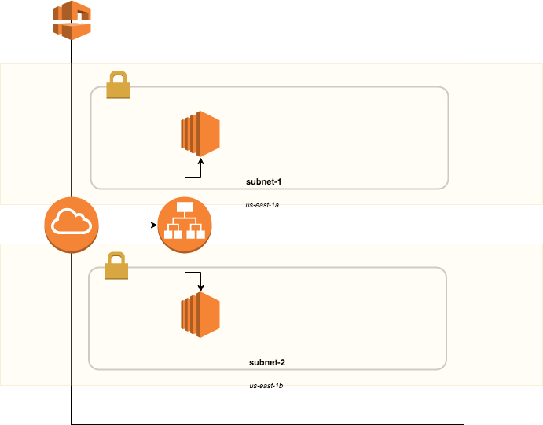

# AWS Meetup -- Terraform

## Demo 3
Build out a basic [infrastructure](#DemoInfrastructure) plan using basic Terraform syntax. 
Using [modules](https://www.terraform.io/docs/configuration/modules.html), we can consolidate plans that your organization / team tend to use as basic building blocks of your infrastructure.  This demo will show how to break out reusable pieces of infrastructure into modules, and use them to build the plan.

----

### Demo Infrastructure

#### Networking Tier
 :white_check_mark: 1 VPC
 :white_check_mark: 2 public subnets (us-east-1a, us-east-1b)
 :white_check_mark: Internet Gateway

#### Application Tier
 :white_check_mark: Application Load Balancer
 :white_check_mark: 2 EC2 Instances distributed between AZs, behind loadbalancer

### Links / References
[Providers](https://www.terraform.io/docs/configuration/providers.html)

[Resources](https://www.terraform.io/docs/configuration/resources.html)

[Resource References](https://www.terraform.io/docs/configuration/interpolation.html#attributes-of-other-resources)

[Modules](https://www.terraform.io/docs/configuration/modules.html)
